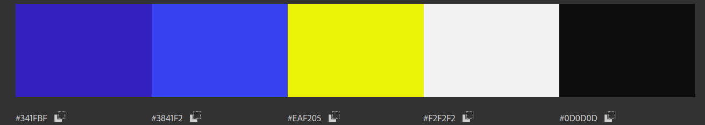
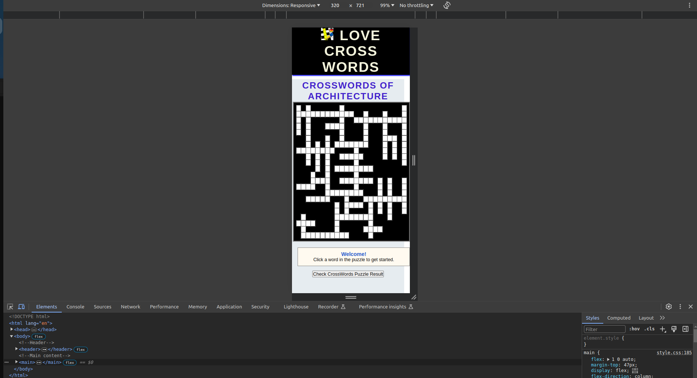
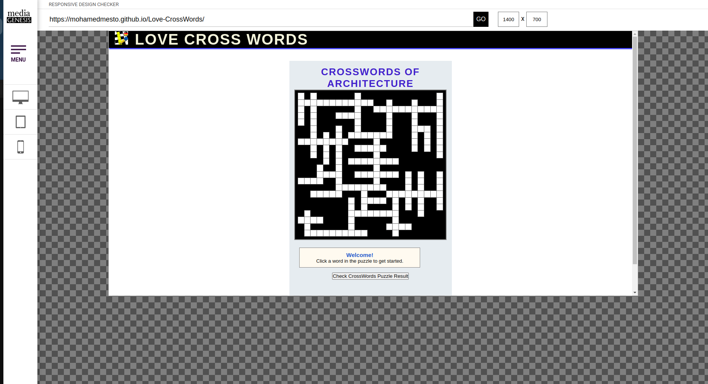

# **_Love Cross Words (Think and play rationally forever) - Project Portfolio 2 - JavaScript_**

"Love Cross Words (Think and play rationally forever)" Engaging in crossword puzzles can be a source of both mental stimulation and motivation. The challenge of deciphering clues and finding the right words within a grid not only exercises one's vocabulary but also promotes cognitive flexibility and problem-solving skills. The satisfaction derived from successfully completing a crossword puzzle can boost self-esteem and provide a sense of accomplishment. Additionally, the variety of topics covered in crosswords exposes individuals to a diverse range of information, making the activity an enjoyable way to learn new words and trivia. Whether it's the thrill of solving challenging clues or the joy of expanding one's knowledge base, the motivation behind tackling crossword puzzles lies in the mental exercise, accomplishment, and the sheer enjoyment of the linguistic journey they offer.

You can view the live site here - <a href="https://mohamedmesto.github.io/Love-CrossWords/" target="_blank"> Love Cross Words </a>

# Contents

- [**_Love Cross Words (Think and play rationally forever) - Project Portfolio 2 - JavaScript_**](#love-cross-words-think-and-play-rationally-forever---project-portfolio-2---javascript)
- [Contents](#contents)
- [Objective](#objective)
- [User Experience (UX)](#user-experience-ux)
  - [Target Audience](#target-audience)
  - [User Stories](#user-stories)
  - [Site Aims](#site-aims)
  - [Design the Episode](#design-the-episode)
  - [Site Structure](#site-structure)
  - [Design Choices](#design-choices)
    - [Colour Scheme](#colour-scheme)
    - [Typography](#typography)
- [Features](#features)
  - [Navigation](#navigation)
  - [Home Page](#home-page)
  - [Fasting Steps page](#fasting-steps-page)
  - [Fasting World Page](#fasting-world-page)
  - [Join us Page](#join-us-page)
  - [Thank You Page](#thank-you-page)
  - [Fasting books Page](#fasting-books-page)
  - [Footer](#footer)
- [Future Features](#future-features)
- [Technologies Used](#technologies-used)
- [Testing](#testing)
  - [Code Validation](#code-validation)
  - [Lighthouse Testing](#lighthouse-testing)
  - [Accessibility Testing](#accessibility-testing)
  - [Responsive Testing](#responsive-testing)
  - [Manual Testing](#manual-testing)
  - [Bugs Fixed](#bugs-fixed)
    - [HTML Validation](#html-validation)
    - [CSS Validation](#css-validation)
    - [Responsiveness](#responsiveness)
- [Deployment](#deployment)
- [Credits](#credits)

# Objective

 The aim of this project is to practice fasting and stay healthy and full power. Moreover, to improve a person's daily life by increasing the ability to concentrate and increasing the efficiency of the body's systems. However, the Engaging in fasting can evoke a sense of inner strength, making individuals feel powerful as they experience heightened mental clarity and a renewed sense of vitality.

[Back to top](<#contents>)

# User Experience (UX)

## Target Audience

- The website caters to individuals seeking a holistic approach to health, targeting those interested in practicing fasting to enhance mental clarity, boost vitality, and improve overall well-being. It appeals to a diverse audience keen on integrating fasting into their lifestyles for optimal health and increased daily performance.

## User Stories

- A user should be able to determine the site's purpose immediately
- A user should be able to easily and intuitively navigate the site
- A user should be able to identify the content of each page easily
- A user should be able to easily learn more about fasting
- A user should feel comfortable Join using the business for more information or to book an event or visit the clinic

## Site Aims
- To increase the user's awareness of how to live a healthy life with a lifestyle that does not require money, but rather requires will
- Explain and share and fasting rules and benefits
- To provide the user with all the information needed to Join us the clinic to book an medical consultation appointment
- To offer a clear method to Join us the fasting compunity
- To improve the sociaty quality in a warm, friendly and inviting manner
- To showcase a visual compilation of completed fasting projects
- To deliver a starting guide to the cost of services
- Share this amazing cure with the whole planet to make the people as much as possible happy, strong and healthy

## Design the Episode 
Design the Episode Love Cross Words- Therapeutic Fasting - Dr.Otto Buchinger (the link is shown below) on the youtube chanel Tips From Europe

The design and structure for this website was created in Video Editor.  

## Site Structure

Love Cross Words (Fasting Treatment) consists of 6 page website with 5 pages that the user can navigate between via the navigation bar.  The Home page is the default loading page. The Logo is centered and is also linked to the Home Page. On the right hand site of the logo are five navigation links of [Home](index.html) , [Fasting Steps](fasting.html) ,[Fasting World](fasting_world.html) , [Join us](join_us.html) and [Fasting books](books.html).

## Design Choices

### Colour Scheme

The final color scheme chosen was shades of blue with white accents, as well as light purple and white to divide the pages. In other words, two light blue colors were used on the navigation bar, a yellow effect to highlight the active page and for a scrolling effect, and a beige color for the writing. This color scheme is in keeping with a clean, modern look but still has a touch of warmth by sticking to warmer colors like navy blue, gray, and white.

### Typography

There were two types of fonts chosen for this website. 'Lemon' was used for the body of the text and 'Lato' for the headings, which is a slightly different version Lemon than the body text to provide emphasis. Besides, sub texts used fonts fall back to 'sans-serif'.  The Lemon fonts exude a subtle sense of luxury, enhanced by their sophisticated serifs that introduce a touch of complexity to the design. Through meticulous adjustments in letter spacing and line heights, we maintain a clean aesthetic while infusing a hint of refinement.

[Back to top](<#contents>)

# Features

Love Cross Words boasts a user-friendly and intuitive design, resembling a conventional website layout, thereby inviting users to seamlessly delve deeper into its offerings.

Upon entering each page, excluding the Home Page, visitors encounter a distinct heading accompanied by a concise paragraph introducing the content. The use of friendly language, vibrant colors, and thoughtful design aims to create an easily understandable and approachable environment. Additionally, the website offers unique and valuable insights, providing readers with extraordinary information not commonly found elsewhere.

## Navigation

- The navigation menu is featured at the top of the page and contains the links to main content.

- The logo is centered in the navigation bar and is clickable and links back to the homepage.

- There are three variations of the navigation bar for different screen sizes, and each keep the same colour and design styles with only the structure changing to keep the user experience as smooth as possible.

## Home Page

- The Home Page serves as the initial landing point for users, offering a warm and inviting design. Its primary objective is to provide a welcoming introduction, ensuring that the purpose of the website is easily discernible to visitors.

- A prominently featured core image, carefully selected for its style, color scheme, and tone, seamlessly aligns with the overall aesthetics of the website. Overlaid on this captivating image are the site name and a succinct slogan highlighting the fasting treatment, ensuring immediate visibility and impact.

- A carefully curated quote strategically peeks just above the fold, offering users a glimpse of the depth of information awaiting them on the page. Crafted to convey the essence of the website – centered around the benefits the concept of God's grace and mercy which is the idea of fasting – the quote aims to resonate with users and set the tone for their exploration..

- Within the Learn of Discipline section on the home page, fasting emerges as a profound instructor. It imparts valuable lessons, fostering patience, nurturing tolerance for hunger, and fortifying one's willpower. Through disciplined self-control, fasting becomes a catalyst for personal growth.

- Each section on the Home Page is meticulously crafted to evoke a sense of warmth and friendliness, intending to inspire users to delve into the website with the ultimate goal of navigating to the Join us Page.

 

 
 
 

Mobile Home Page

 

 

## Fasting Steps page

- The Fasting Steps page adheres to its navigation link description, presenting a clear and organized list of available events.

- Utilizing distinct alternate color designs, along with headings, images, and text, the page effectively distinguishes between different fasting steps.

- It boasts full responsiveness, with each fasting steps section naturally aligning into a single column, maintaining a consistent and clear color design for easy differentiation.

- The page aims to convey a welcoming and friendly atmosphere, suggesting it as the perfect fit for users seeking specific events. Users are encouraged to approach the business for additional information tailored to their unique event needs.

[Back to top](<#contents>)

## Fasting World Page

- The Fasting World Page provides the user with some sample photography from the Fasting World, the story, clinic ,fasting plan, Animals which fast. 

- The Fasting World is easy to use, with a hover function on the images drawing the users eye to the cursor.

- The Fasting World Page is fully responsive and as the screen reduces in size the columns of images reduce until the images are full width in mobile devices.

[Back to top](<#contents>)

## Join us Page

- The Join us page is should be where the user ends up. As there is no booking system or online store to purchase a fasting steps the aim is for them to reach out to the health goal.

- The Join us form is modelled off the usual Join us form layout, with four input fields; First Name, Last Name, Email Address and Your Message.

- The Join us form cannot be submitted unless the fields are filled correctly using the required attribute.

- The form also uses a GET function to link to a Thank You page to mimic the effect of actually submitting the form . There is no actual information submitted when the user completes the form and the thank you page is purely to show how the user will interact with the form.

- Beside the Join us form there are practical Join us details such as a dummy phone number and email. The email has a mailto link which opens to the users default mail software on their device, againing using a dummy email for the purpose of user experience.

- The page is fully responsive with the sections stacking upon each other as the screen size is reduced, keeping the same design elements which distinguish between the different sections.

 

[Back to top](<#contents>)

## Thank You Page

- The Thank You page cannot be accessed by the user from any links on the website. It can only be accessed by submitting the Join us form on the Join us page which uses a GET function to retrieve the page to imitate the Join us form submission.

- The style and design of the website is consistent, with the navigation bar on top and footer on the bottom so as to allow the user to navigate back to the main website.

[Back to top](<#contents>)

 ## Fasting books Page

- The Fasting books Page provides the user with some books sample photography from the experters. It gives a mix of different ideas, food and methods in one large Fasting books.

- The Fasting books is easy to use and to apply.

- The Fasting books Page is fully responsive and as the screen reduces in size the columns of images reduce until the images are full width in mobile devices.

[Back to top](<#contents>)

## Footer

- The Footer contains the social media links.

- For better UX design, each of the social media links open in a new tab.

- The Facebook, Instagram and Youtube links are purely for the educational purposes of the website and only navigate to the home page of each of the sites.

- It also contains an email link which uses a mailto function to open the devices preferred email software. The email used is just a dummy email to show how the user interacts with the link.

[Back to top](<#contents>)

# Future Features

- organizion Fast plan online.

- The fasting world can be expanded whereby a lightbox function can be implemented to achieve a greate user experience and interactivity with the images.

- The fasting world could also be categorised by event for better UX, to allow the user to navigate directly to photos of interest to them.

- A Log In could be added whereby clients would have access to the photos of their event in a private fasting world, will will provide a swifter service for the business, cutting out another physical meeting with clients to choose their photos.

- The mobile navigation menu could be changed into a burger menu.

- An eccomerce online shop could be added for the sale of stock prints.

# Technologies Used

- HTML5 - Delivers the structure and content for the website.
- CSS3 - Provides the styling for the website.
- [Adobe XD](https://www.adobe.com/ie/products/xd.html) - Used to create wireframes for the website
- [Adobe Illustrator](https://www.adobe.com/ie/products/illustrator.html) - Used to create the Logo and social media assets for the website.
- [Adobe Photoshop](https://www.adobe.com/ie/products/photoshop.html) - used to resize images and export them as progressive JPEG files.
- [Adobe Color](https://color.adobe.com/create/color-contrast-analyzer) - Used to test the contrast and a blind safe colour check for the colour palette used.
- [Adobe Lightroom](https://www.adobe.com/ie/products/photoshop-lightroom.html) - Used to optimise and resize images for screen.
- [I love IMG](https://www.iloveimg.com/de) - Used to further compress optimised images.
- Gitpod - Used to develop the website.
- GitBash - Terminal used to push changes to the GitHub repository.
- Github - Used to host and deploy the website.

[Back to top](<#contents>)

# Testing

## Code Validation

Love Cross Words has been validated via W3C HTML Validator and the W3C CSS Validator. There were 6 minor errors that came up for all of the pages. This was immediately corrected and documented down below in [Bugs Fixed](<#bugs-fixed>).

## Lighthouse Testing

The website was also put through Lighthouse testing via Chrome Devtools which tests a site under 4 different headings; Performance, Accessibility, Best Practices and it tests it under mobile and desktop criteria.

## Accessibility Testing

[A11y](https://color.a11y.com/) was used to check the colour contrast on the website for accessibility purposes which it passed.

[Adobe Color](https://color.adobe.com/create/color-accessibility) was also used to test that the colour scheme was accessible for those with different types of blindness which it also succeded in doing.

 

## Responsive Testing

Responsiveness was tested via a few different mediums manually, including Chrome Devtools, [The Viewport Resizer](https://chrome.google.com/webstore/detail/viewport-resizer-%E2%80%93-respon/kapnjjcfcncngkadhpmijlkblpibdcgm?hl=en) chrome extension and [The Responsive Design Checker](https://responsivedesignchecker.com/) website.

## Manual Testing

In addition to the automated process above, manual testing was carried out on the site as well.

- Naviagtion Menu
  - Verified that all the links link to the appropriate page with no broken links on all pages.
  - Verified that the logo when clicked links back to the Home Page.
  - Verified that the logo image has an alt text and fallback image for non browser support of the svg file.
  - Verified that the hover effects are consistent on all links.
  - Verified that the active page is highlighted.
  - Verified that the navigation bar is full responsive.

- Home Page
  - Verified that the Hero image is not pixelated and is fully responsive.
  - Verified that all images on the home page are optimised and have alt functions.
  - Verified that all the elements are fully responsive

- fasting steps Page
  - Verified that all the images are optimised and have alt texts.
  - Verified that all the elements are fully responsive.

- Fasting World Page
  - Verfied all the images are optimised and have alt texts.
  - Verified that all elements are fully responsive.

- Join us Page
  - Verified that Join us form cannot be submitted without the required information (First Name, Last Name and Email Address)
  - Verified that once the information is submitted via Join us form, that the GET function works correctly and retrieves the thank you page.
  - Verified that the mailto function works correctly on the email link.
  - Verified that the page is fully responsive.

- Thank You Page
  - Verified that the thank you page is linked correctly to the Join us form.
  - Verified that the Thank You Page is fully responsive.

- Footer
  - Verrified that the email asset links properly with the mailto function.
  - Verified that the social media links are all linked properly to the releveant social media home pages.
  - Verified that all the social media links open in a new tab.

- Browser Testing

  - Love Cross Words has been manually tested in Google Chrome, Microsoft Edge, Mozilla Firefox and Safari on both desktop and mobile.
  - Verified that all images worked correctly
  - Verified that design and structure was consistent across all browsers.
  - Verfied responsiveness across all browsers.

## Bugs Fixed

### HTML Validation

The following error was presented once the website was placed through W3C HTML Validator.

 

It said that the img id could not be used for  each image on th e footer width and height attributes in the footer images produced " Expected a digit but saw p instead". Once I removed the img id from the attributes, it cleared that error up.

### CSS Validation

The  error cropped up when the site was initially put through CSS validation.

While no problems were indicated in the CSS file in using false css attribute represnted in hr - size, I correct it to height and the error cleared.

 

 

### Responsiveness

Chrome Devtools was initially used to test the responsiveness of the website. However it proved to be somewhat inconsistent with results despite no code being changed. Therefore another Chrome extension was used, [Viewport Resizer](https://chrome.google.com/webstore/detail/viewport-resizer-%E2%80%93-respon/kapnjjcfcncngkadhpmijlkblpibdcgm?hl=en) and a website, [Responsive Design Checker](https://responsivedesignchecker.com/) was used in conjunction with Chrome Devtools to make sure the website was fully responsive.

[Back to top](<#contents>)

# Deployment

The website was deployed to GitHub pages via the following methods:

1. Navigate to the Settings tab in the GitHub repository for the project.
2. On the left hand side, scroll down to the pages tab.
3. Under the Source tab, choose the branch called Main and in the dropdown beside it select the folder called Root.
4. Click save.
5. The page automatically displays the deployed link at the top once save is clicked.
6. It can take up to 5 minutes to deploy.

[Back to top](<#contents>)

# Credits

- Fonts were sourced from [Google Fonts](https://fonts.google.com/)
- Some images from the website were sourced from [Pexels](https://www.pexels.com/) and [Unsplash](https://unsplash.com/)
- Images were compressed by [Tiny Png](https://tinypng.com/)
- Colour palette was created by [coolors.co](https://coolors.co/)
- Flexbox system was learned via youtube video from [LearnWebCode](https://www.youtube.com/watch?v=k32voqQhODc&ab_channel=LearnWebCode)
- Flexbox Image grid from [Kweku Adaboh](https://kweada.medium.com/css-flexbox-image-grid-for-different-sized-images-ff48cbe52ed4)
- CSS Grid code was learned via [Traversy Media](https://www.youtube.com/watch?v=jV8B24rSN5o&t=7s&ab_channel=TraversyMedia) and [CSS Tricks](https://css-tricks.com/look-ma-no-media-queries-responsive-layouts-using-css-grid/)
- Code for CSS transform scale properties comes from [Learn with Param](https://learnwithparam.com/blog/scale-elements-on-hover-using-css/#:~:text=Often%20we%20get%20a%20requirement%20to%20scale%20images,%2F%2F%20shrinking%20in%20size.shrink%3Ahover%20%7B%20transform%3A%20scale%280.8%29%3B%20%7D)
- Code for drawing a border inside a shape/image was from [CodeLab](https://www.tutorialrepublic.com/codelab.php?topic=faq&file=draw-border-inside-div-element-with-css)
- Link to the quote by [Destin Sparks](https://twitter.com/DestinSparks/status/757136759406727168?cxt=HHwWgMCg7eD38YEVAAAA)
- Image optimisation was learned from [Layout, Flywheel](https://getflywheel.com/layout/optimize-images-for-web/#file-type)
- Some materials are reserved to the German Navy ,Therapeutic Fasting Prof.Dr. Otto Buchinger, Miracle successful, How to live a happy healthy life.
- Some of the commands, statement are sourced from the our course from Code Institute.
- The story of fasting is taken from the heavenly ,Holy books (the Torah, the Bible, and the Quran) 
- The story topic, Materials of therapeutic fasting is taken from the website:  
- [Dr. Otto buchinger](https://www.buchinger-wilhelmi.com/en/geschichte-des-heilfastens/) 
- [Dr. Otto buchinger Clinic](https://www.buchinger.de/en/)
- The images are sourced from the Internet Medical ,Healthy websites:
- [Praxisvita](https://www.praxisvita.de/lunge-das-wichtige-organ-16228.html) 
- [Rehafit rain](https://rehafit-rain.de/kurse/rehasport-lunge) 
- [Snexplores](https://www.snexplores.org/article/explainer-what-is-a-neuron)
- [Longevity technology](https://longevity.technology/lifestyle/key-functions-of-nerve-cells-you-need-to-know/)
- [Educatefitness](https://educatefitness.co.uk/the-structure-and-function-of-the-heart-simplified/)
- [Scmp](https://www.scmp.com/lifestyle/health-wellness/article/3092629/brain-how-it-works-and-best-ways-keep-it-healthy-you-get
)
- Readme Template is sourced from [love-running-2.0](https://code-institute-org.github.io//index.html) 

 
