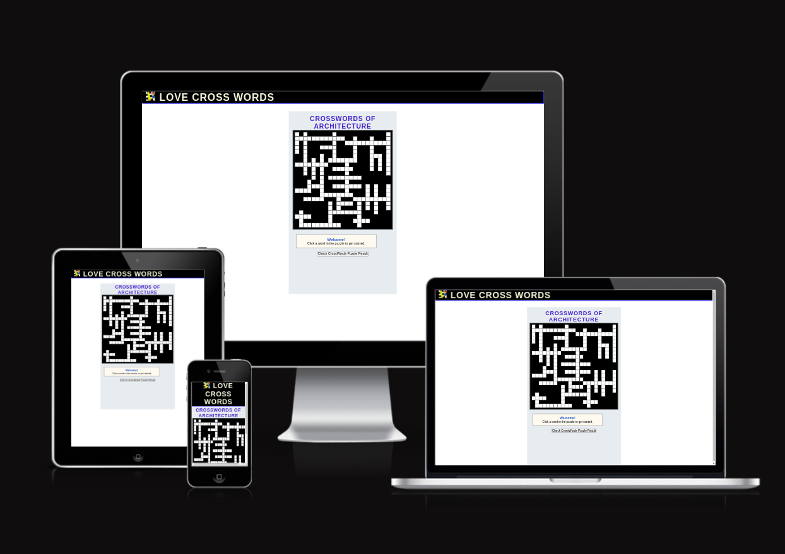
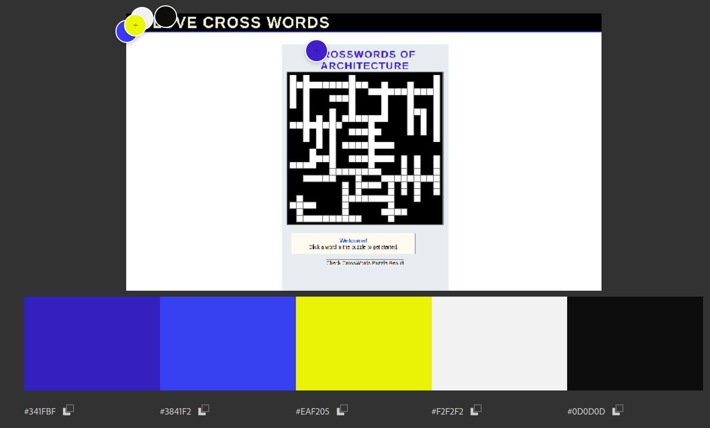
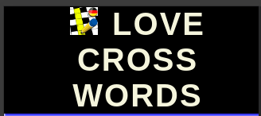
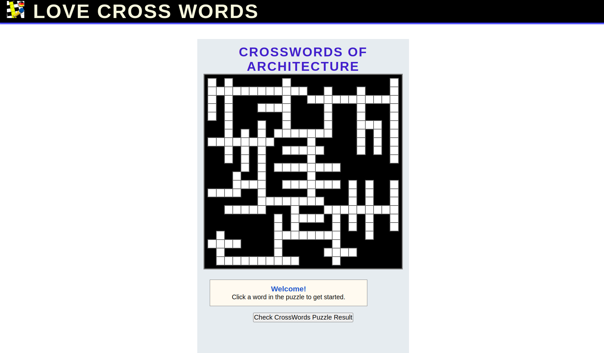
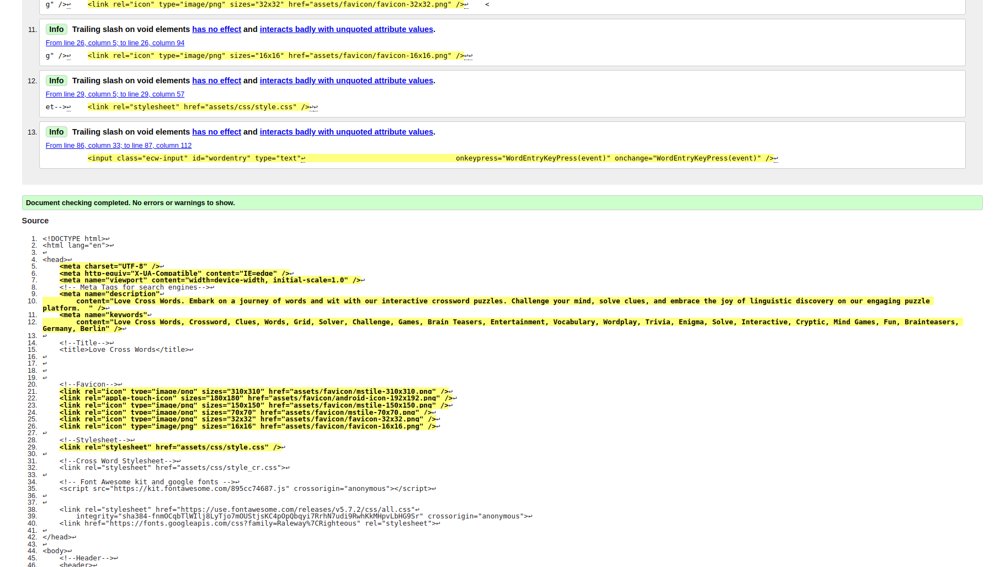
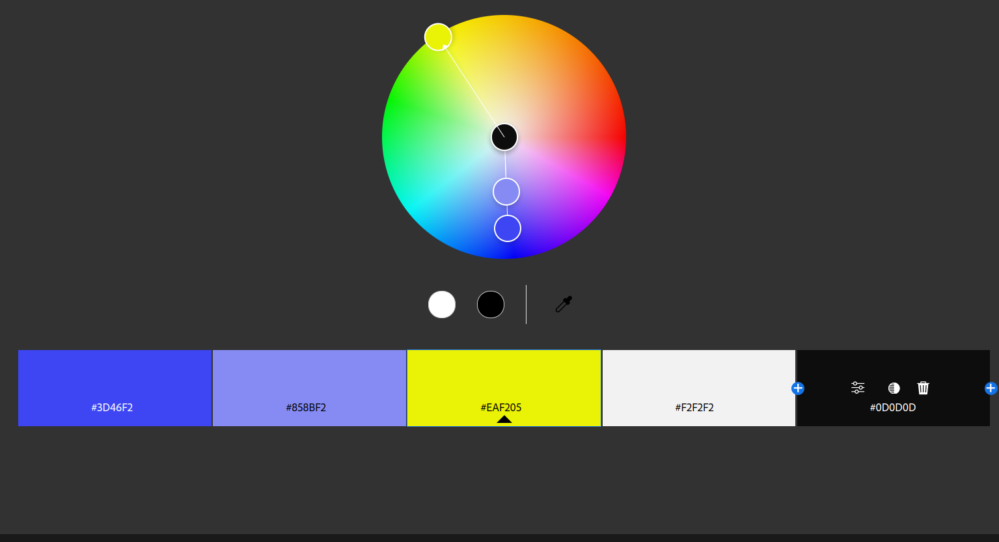
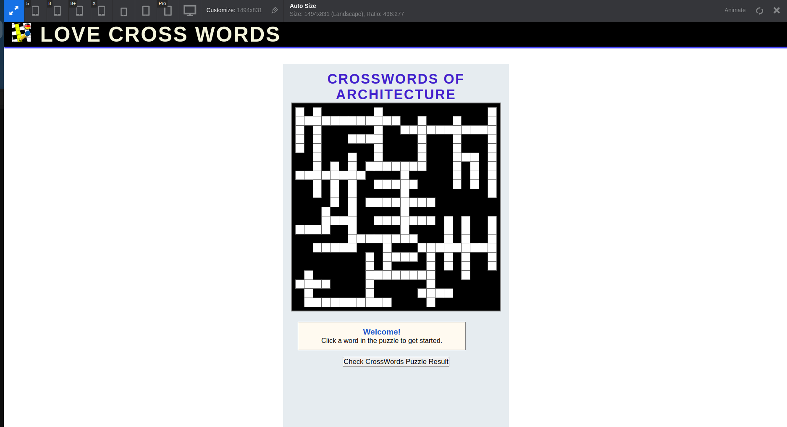

# **_Love Cross Words (Think and play rationally forever) - Project Portfolio 2 - JavaScript_**

"Love Cross Words (Think and play rationally forever)" Engaging in crossword puzzles can be a source of both mental stimulation and motivation. The challenge of deciphering clues and finding the right words within a grid not only exercises one's vocabulary but also promotes cognitive flexibility and problem-solving skills. The satisfaction derived from successfully completing a crossword puzzle can boost self-esteem and provide a sense of accomplishment. Additionally, the variety of topics covered in crosswords exposes individuals to a diverse range of information, making the activity an enjoyable way to learn new words and trivia. Whether it's the thrill of solving challenging clues or the joy of expanding one's knowledge base, the motivation behind tackling crossword puzzles lies in the mental exercise, accomplishment, and the sheer enjoyment of the linguistic journey they offer.

You can view the live site here - <a href="https://mohamedmesto.github.io/Love-CrossWords/" target="_blank"> Love Cross Words </a>

 
# Contents

- [**_Love Cross Words (Think and play rationally forever) - Project Portfolio 2 - JavaScript_**](#love-cross-words-think-and-play-rationally-forever---project-portfolio-2---javascript)
- [Contents](#contents)
- [Objective](#objective)
- [User Experience (UX)](#user-experience-ux)
  - [Target Audience](#target-audience)
  - [User Stories](#user-stories)
  - [Site Aims](#site-aims)
  - [Site Structure](#site-structure)
  - [Design Choices](#design-choices)
    - [Colour Scheme](#colour-scheme)
    - [Typography](#typography)
- [Features](#features)
  - [Navigation](#navigation)
  - [Home Page](#home-page)
    - [Cross Word Game Area](#cross-word-game-area)
    - [Answer Section](#answer-section)
    - [Check CrossWords Puzzle Result Section (Button)](#check-crosswords-puzzle-result-section-button)
- [Future Features](#future-features)
- [Technologies Used](#technologies-used)
- [Testing](#testing)
  - [Code Validation](#code-validation)
  - [Lighthouse Testing](#lighthouse-testing)
  - [Accessibility Testing](#accessibility-testing)
  - [Responsive Testing](#responsive-testing)
  - [Manual Testing](#manual-testing)
  - [Bugs Fixed](#bugs-fixed)
    - [HTML Validation](#html-validation)
    - [CSS Validation](#css-validation)
    - [Responsiveness](#responsiveness)
- [Deployment](#deployment)
- [Credits](#credits)

# Objective

 
The primary aim of our crossword puzzle application is to offer users an intellectually stimulating and entertaining experience. By presenting a diverse range of carefully crafted puzzles, our application seeks to challenge and enhance users' vocabulary, problem-solving skills, and cognitive agility. Through an intuitive and user-friendly interface, we aim to create an immersive environment that encourages individuals to engage in the joy of solving puzzles. Whether users are seeking a momentary mental escape or a daily dose of linguistic adventure, our application strives to cater to various skill levels, fostering a community of crossword enthusiasts who appreciate the satisfaction of cracking clues and unlocking the vast world of words.

[Back to top](<#contents>)

# User Experience (UX)

## Target Audience

- Our crossword puzzle application is designed to appeal to a broad spectrum of individuals who appreciate mental challenges and enjoy linguistic pursuits. It caters to crossword enthusiasts of all ages, from seasoned wordplay aficionados looking for a daily brain workout to beginners eager to embark on a journey of intellectual discovery. The application's user-friendly interface makes it accessible for both casual gamers seeking leisure and dedicated crossword solvers in search of a more immersive experience. With varying difficulty levels, our target audience includes anyone keen on enhancing their vocabulary, honing problem-solving skills, and finding enjoyment in the art of wordsmithing. Whether you're a crossword connoisseur or a newcomer to the world of word games, our application offers an engaging and inclusive platform for all.

## User Stories

- A user should be able to inter the Cross Words site's purpose immediately
- A user should be able to easily and intuitively navigate the Cross Word game
- A user should be able to identify the aim of each section of the Cross Word game's contents easily
- A user should be able to easily learn more about mental stimulation and motivation
- A user should feel comfortable using the solve feature when he could not giss the right word.

## Site Aims

1. **Architectural Education:** The application aims to serve as an educational platform, introducing users to architectural terminology, styles, and historical landmarks through crossword puzzles. By incorporating architectural themes into the puzzles, users can enhance their knowledge of the subject in an engaging and interactive way.

2. **Promoting Cultural Awareness:** The crossword puzzles within the application are crafted to feature architectural wonders from various cultures and time periods. This not only enriches users with global architectural knowledge but also promotes cultural awareness and appreciation for diverse design styles and influences.

3. **Skill Development:** The application strives to improve users' problem-solving skills by challenging them to decipher architectural clues and fill in relevant terms within the puzzles. This not only stimulates cognitive abilities but also enhances their ability to recognize and recall architectural concepts.

4. **Entertainment with a Purpose:** While providing an entertaining experience, the application has the additional aim of infusing purposeful content related to architecture. It seeks to balance enjoyment with educational value, making it an ideal platform for users who wish to combine leisure with learning about architectural history and principles.

5. **Community Building:** Beyond individual play, the application fosters a community of architecture enthusiasts. Users can share their achievements, discuss architectural topics, and engage in collaborative puzzle-solving challenges. This community aspect aims to create a space where individuals passionate about architecture can connect, share insights, and collectively appreciate the beauty of the built environment.

 

## Site Structure

Love Cross Words (Think and play rationally forever) consists of 3 page website components of the [Home page](index.html). Which enable the user to navigate between them via  mouse or hand using the touch screens.  The Home page is the default loading page. The logo is located at teh keft and is also linked to the Home Page.The Cross words game area located in the center. on the bottom is the answer box located. After finishing we find the buttom "Check CrossWords Puzzle Result" to get the result .

## Design Choices

### Colour Scheme

The color scheme of our architectural crossword puzzle application is meticulously chosen to evoke a sense of sophistication and creativity. Dominated by cool and muted tones such as subtle grays and blues, the interface provides a calm and focused backdrop, allowing users to concentrate on solving puzzles. Accents of warm earthy tones, inspired by natural building materials, add a touch of warmth and connection to architectural elements. The color palette aims to reflect the elegance of architectural design while ensuring readability and visual comfort. Overall, the harmonious blend of colors creates an aesthetically pleasing environment that complements the intellectual engagement of exploring the world of architecture through crossword challenges.

### Typography

The typography of our architectural crossword puzzle application is designed for clarity and readability, aligning with a minimalist aesthetic. Utilizing a classic combination of black text on a white background ensures optimal legibility, reducing eye strain during extended puzzle-solving sessions. We employ a clean and modern sans-serif font to convey a sense of simplicity and sophistication, enhancing the overall user experience. The well-defined letterforms contribute to an organized and visually pleasing interface, allowing players to focus on deciphering architectural clues effortlessly. This intentional choice in typography aims to create a sleek, user-friendly environment that complements the intellectual engagement of exploring architectural concepts through crossword challenges..

[Back to top](<#contents>)

# Features

Welcome to Love Cross Words, where the fusion of thinking and play lasts a lifetime! Our three-section website starts with the Home section, the default loading screen. The logo, intelligently placed on the left, serves as a clickable link, seamlessly bringing you back to the Home section. In the heart of our design lies the Cross Words game area, inviting you to dive into a world of intellectual delight. At the bottom, you'll discover the answer box, patiently awaiting your solutions. Upon completion, a final touch awaits with the 'Check CrossWords Puzzle Result' button—your gateway to unveiling the outcome of your rational journey. Navigate effortlessly through sections via mouse or touch screen, as Love Cross Words promises an intuitive and engaging experience.

## Navigation

- The navigation menu is featured at the top of the page and contains the links to main content.

- The logo is centered in the navigation bar and is clickable and links back to the homepage.

- There are three variations of the navigation bar for different screen sizes, and each keep the same colour and design styles with only the structure changing to keep the user experience as smooth as possible.

 

## Home Page

### Cross Word Game Area
 

### Answer Section

### Check CrossWords Puzzle Result Section (Button)

 
 

[Back to top](<#contents>)

  

# Future Features

1. **Expanded Color Palette:** Introduce a richer color scheme inspired by architectural elements, offering a visually immersive experience. Incorporate hues representative of various materials and design aesthetics, enhancing the overall aesthetic appeal.

2. **Diverse Architectural Topics:** Enrich the puzzle database with a broader range of architectural topics, spanning from iconic landmarks to lesser-known architectural wonders. This expansion ensures that users encounter a diverse array of challenges, broadening their knowledge of architectural styles and history.

3. **Global Architectural Exploration:** Implement puzzles centered around architectural achievements from different countries, allowing users to explore and appreciate the diverse architectural landscapes worldwide. This global perspective adds an educational and cultural dimension to the crossword-solving experience.

4. **Centuries in Architecture:** Introduce puzzles that span different centuries, offering a chronological journey through architectural evolution. Users can engage with challenges from various time periods, witnessing the evolution of design principles and construction techniques.

5. **Multiplayer Mode:** Foster a sense of community and competition by incorporating a multiplayer mode. Users can challenge friends or connect with crossword enthusiasts worldwide, engaging in collaborative puzzle-solving or competing for the fastest completion times. This social feature adds a dynamic and interactive dimension to the application.

6. **Personalized Profiles and Achievements:** Enhance user engagement by introducing personalized profiles and achievement systems. Users can track their progress, earn badges for completing specific challenges, and unlock virtual rewards. This gamification element adds an extra layer of motivation for users to continuously explore and conquer new architectural crossword puzzles.
   
# Technologies Used

- HTML5 - Delivers the structure and content for the website.
- CSS3 - Provides the styling for the website.
- [Adobe XD](https://www.adobe.com/ie/products/xd.html) - Used to create wireframes for the website
- [Adobe Illustrator](https://www.adobe.com/ie/products/illustrator.html) - Used to create the Logo and social media assets for the website.
- [Adobe Photoshop](https://www.adobe.com/ie/products/photoshop.html) - used to resize images and export them as progressive JPEG files.
- [Adobe Color](https://color.adobe.com/create/color-contrast-analyzer) - Used to test the contrast and a blind safe colour check for the colour palette used.
- [Adobe Lightroom](https://www.adobe.com/ie/products/photoshop-lightroom.html) - Used to optimise and resize images for screen.
- [I love IMG](https://www.iloveimg.com/de) - Used to further compress optimised images.
- Vcode Editor
- Gitpod - Used to develop the website.
- GitBash - Terminal used to push changes to the GitHub repository.
- Github - Used to host and deploy the website.

[Back to top](<#contents>)

# Testing

## Code Validation

Love Cross Words has been validated via W3C HTML Validator and the W3C CSS Validator. There were 1 minor errors that came up for home page. This was immediately corrected and documented down below in [Bugs Fixed](<#bugs-fixed>).

For Style.css and Style_cr.css files.

For script_desc.js and script_fn.js

 

## Lighthouse Testing

The website was also put through Lighthouse testing via Chrome Devtools which tests a site under 4 different headings; Performance, Accessibility, Best Practices and it tests it under mobile and desktop criteria.

## Accessibility Testing 

[A11y](https://color.a11y.com/) was used to check the colour contrast on the website for accessibility purposes which it passed.

[Adobe Color](https://color.adobe.com/create/color-accessibility) was also used to test that the colour scheme was accessible for those with different types of blindness which it also succeded in doing.

 

## Responsive Testing

Responsiveness was tested via a few different mediums manually, including Chrome Devtools, [The Viewport Resizer](https://chrome.google.com/webstore/detail/viewport-resizer-%E2%80%93-respon/kapnjjcfcncngkadhpmijlkblpibdcgm?hl=en) chrome extension and [The Responsive Design Checker](https://responsivedesignchecker.com/) website.

## Manual Testing

In addition to the automated process above, manual testing was carried out on the site as well.

- Home Page

- Cross Word Game Area
 
- Answer Section
 
- Check CrossWords Puzzle Result Section (Button)

all the previous sections checked manually to be sure that all work well.

## Bugs Fixed

### HTML Validation

The following error was presented once the website was placed through W3C HTML Validator.

It said that the script of js do not need type="text/javascript". Once I removed it from the attributes, it cleared that error up.

### CSS Validation

There was an error by a size attribute. and already fixed

 

 

### Responsiveness

Chrome Devtools was initially used to test the responsiveness of the website. However it proved to be somewhat inconsistent with results despite no code being changed. Therefore another Chrome extension was used, [Viewport Resizer](https://chrome.google.com/webstore/detail/viewport-resizer-%E2%80%93-respon/kapnjjcfcncngkadhpmijlkblpibdcgm?hl=en) and a website, [Responsive Design Checker](https://responsivedesignchecker.com/) was used in conjunction with Chrome Devtools to make sure the website was fully responsive.

[Back to top](<#contents>)

# Deployment

The website was deployed to GitHub pages via the following methods:

1. Navigate to the Settings tab in the GitHub repository for the project.
2. On the left hand side, scroll down to the pages tab.
3. Under the Source tab, choose the branch called Main and in the dropdown beside it select the folder called Root.
4. Click save.
5. The page automatically displays the deployed link at the top once save is clicked.
6. It can take up to 5 minutes to deploy.

[Back to top](<#contents>)

# Credits

- Fonts were sourced from [Google Fonts](https://fonts.google.com/)
- Some images from the website were sourced from [Pexels](https://www.pexels.com/) and [Unsplash](https://unsplash.com/)
- Images were compressed by [Tiny Png](https://tinypng.com/)
- Colour palette was created by [coolors.co](https://coolors.co/)
- Flexbox system was learned via youtube video from [LearnWebCode](https://www.youtube.com/watch?v=k32voqQhODc&ab_channel=LearnWebCode)
- Flexbox Image grid from [Kweku Adaboh](https://kweada.medium.com/css-flexbox-image-grid-for-different-sized-images-ff48cbe52ed4)
- CSS Grid code was learned via [Traversy Media](https://www.youtube.com/watch?v=jV8B24rSN5o&t=7s&ab_channel=TraversyMedia) and [CSS Tricks](https://css-tricks.com/look-ma-no-media-queries-responsive-layouts-using-css-grid/)
- Code for CSS transform scale properties comes from [Learn with Param](https://learnwithparam.com/blog/scale-elements-on-hover-using-css/#:~:text=Often%20we%20get%20a%20requirement%20to%20scale%20images,%2F%2F%20shrinking%20in%20size.shrink%3Ahover%20%7B%20transform%3A%20scale%280.8%29%3B%20%7D)
- Code for drawing a border inside a shape/image was from [CodeLab](https://www.tutorialrepublic.com/codelab.php?topic=faq&file=draw-border-inside-div-element-with-css)
- Link to the quote by [Destin Sparks](https://twitter.com/DestinSparks/status/757136759406727168?cxt=HHwWgMCg7eD38YEVAAAA)
- Image optimisation was learned from [Layout, Flywheel](https://getflywheel.com/layout/optimize-images-for-web/#file-type)
- Some materials are reserved to the German Navy ,Therapeutic Fasting Prof.Dr. Otto Buchinger, Miracle successful, How to live a happy healthy life.
- Some of the commands, statement are sourced from the our course from Code Institute.
- The story of fasting is taken from the heavenly ,Holy books (the Torah, the Bible, and the Quran) 
- The story topic, Materials of therapeutic fasting is taken from the website:  
- The images are sourced from the Internet Medical ,Healthy websites:
- [Praxisvita](https://www.praxisvita.de/lunge-das-wichtige-organ-16228.html) 
- [Rehafit rain](https://rehafit-rain.de/kurse/rehasport-lunge) 
- [Snexplores](https://www.snexplores.org/article/explainer-what-is-a-neuron)
- [Longevity technology](https://longevity.technology/lifestyle/key-functions-of-nerve-cells-you-need-to-know/)
- [Educatefitness](https://educatefitness.co.uk/the-structure-and-function-of-the-heart-simplified/)
- [Scmp](https://www.scmp.com/lifestyle/health-wellness/article/3092629/brain-how-it-works-and-best-ways-keep-it-healthy-you-get
)
- Readme Template is sourced from [love-running-2.0](https://code-institute-org.github.io//index.html) 
-  Logo is sourced from [qonversion.io](https://qonversion.io/apps/ios/crossword-puzzle-universe/1552720930)  

- Some contents are sourced from [EclipseCrossword](eclipsecrossword.com)
 
